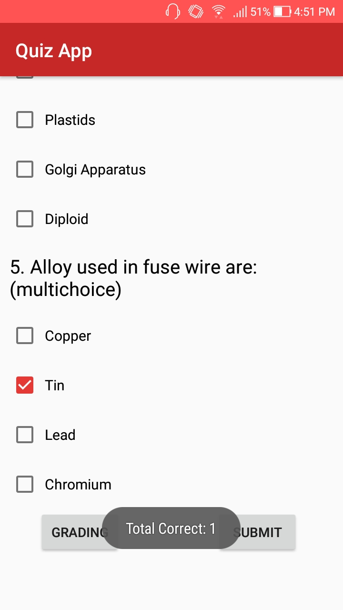
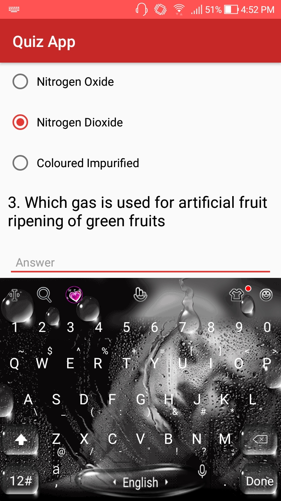
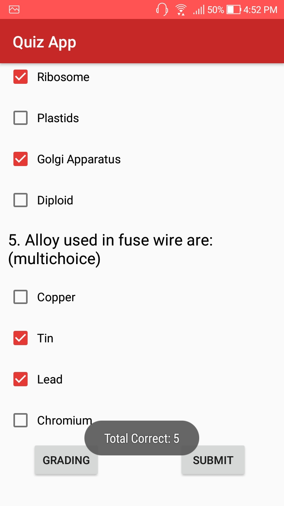
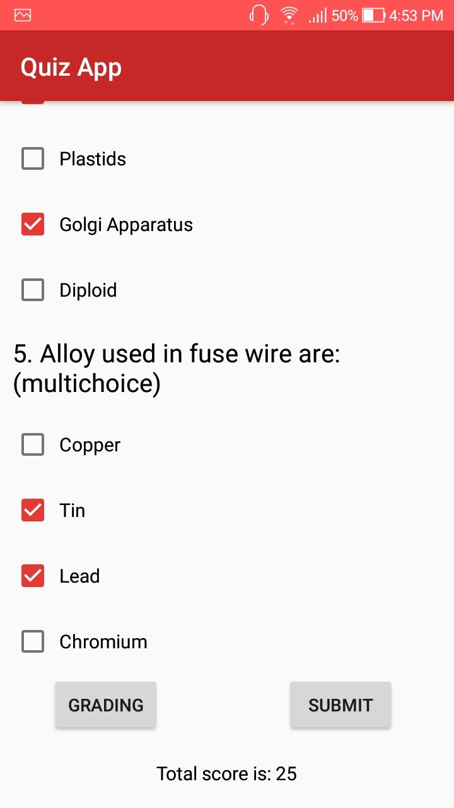

# Quiz App

This project was made as a part of Android Foundation  I Nanodegree Program. This is a Quiz App which contains these types of questions:

| Type of Question | Way of implementation |
| ---------------- | --------------------- |
| Text Response    | Textbox               |
| Single Choice    | Radio Buttons         |
| Multiple Choice    | Checked Boxes         |

App includes a Submit button for the user to submit their answers and receive a score as well as a Grading button which displays a toast which accurately displays the results of the quiz.

The app video can be found at this [link](video.mp4) 

Some of the screenshots from the app are displayed below : 

